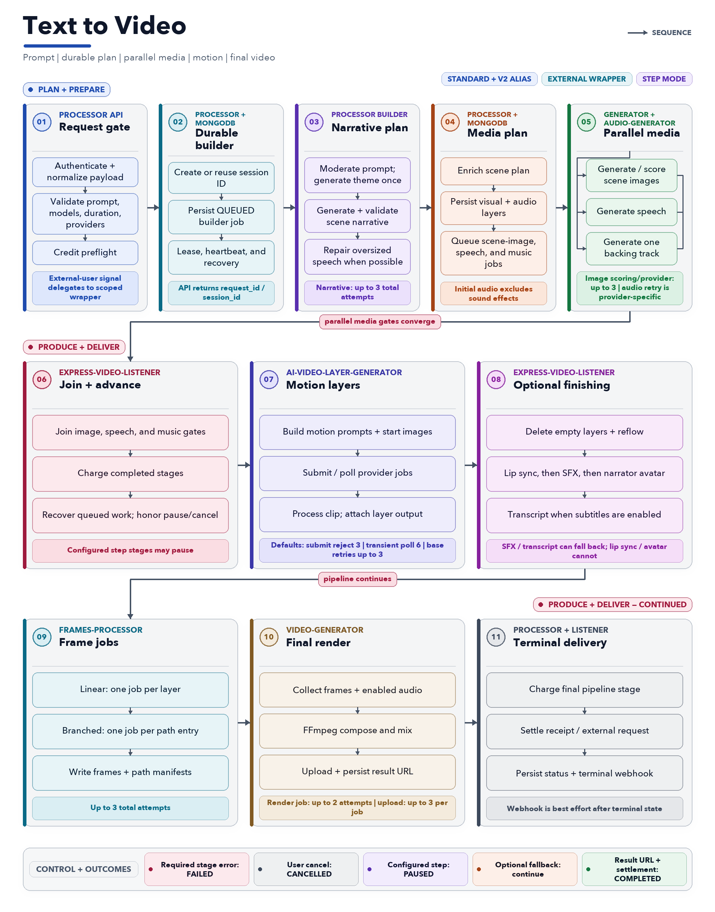
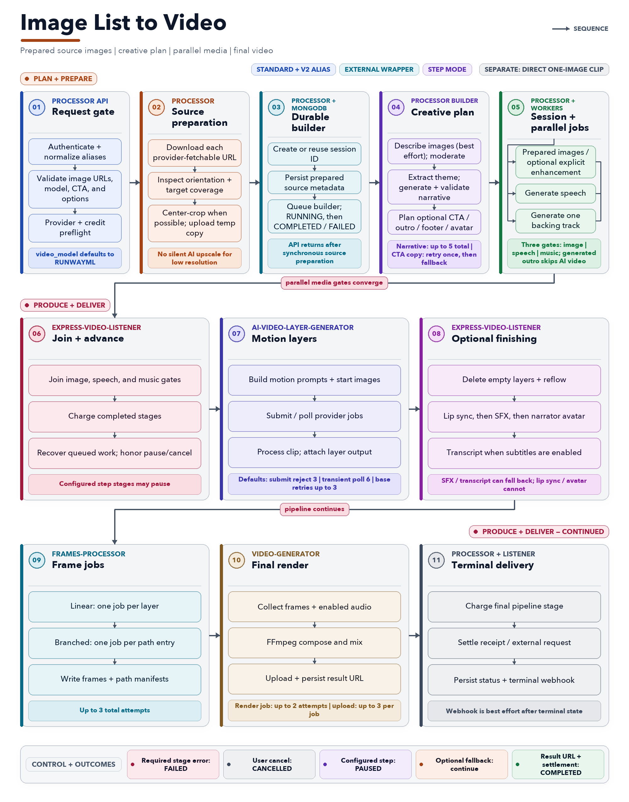
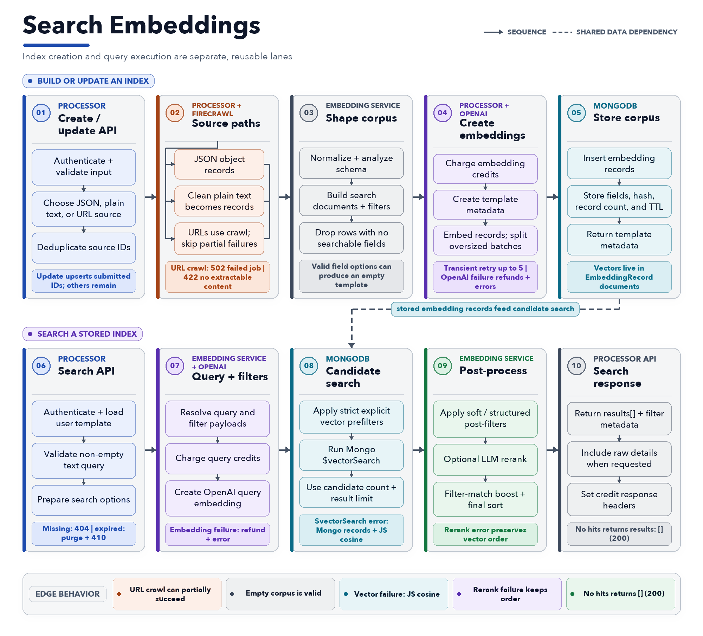
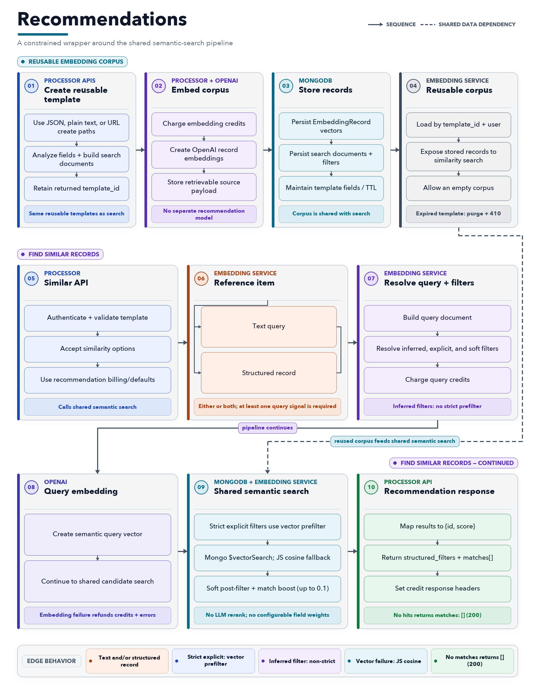

<h1 align="center">
  <a href="https://app.samsar.one">
    
  </a>
</h1>

<p align="center">
  <strong>Samsar is a generative video and media automation platform for turning prompts, product images, structured content, and creative ideas into finished videos and reusable studio assets.</strong>
</p>

<p align="center">
  It brings together one-shot text-to-video, image-list-to-video, image editing, audio generation, semantic search, recommendations, assistant workflows, multi-provider model routing, and detailed post-production controls across one integrated Studio and API surface.
</p>

<p align="center">
  <a href="https://app.samsar.one"><strong>Production app</strong></a>
  ·
  <a href="https://docs.samsar.one"><strong>Production API docs</strong></a>
  ·
  <a href="https://youtube.com/@samsar_one"><strong>Demo channel</strong></a>
  ·
  <a href="#quick-start"><strong>Setup wizard</strong></a>
</p>

<p align="center">
  <a href="https://github.com/samsarone/samsar/actions/workflows/ci.yml">
    
  </a>
  <a href="LICENSE">
    
  </a>
</p>

<p align="center">
  <a href="#features">Features</a>
  ·
  <a href="#quick-start">Quick start</a>
  ·
  <a href="#visual-workflows">Workflows</a>
  ·
  <a href="#documentation">Documentation</a>
  ·
  <a href="#adapters-models-and-storage">Adapters</a>
  ·
  <a href="#api">API</a>
  ·
  <a href="#deployment-and-operations">Operations</a>
</p>

---

## Features

- **One-shot Studio text-to-video up to 3 minutes** for documentary, infotainment, ed-tech, film summary, custom themes, and original ideas.
- **One-shot image-list-to-video** that turns product images into polished ad videos with optional narrator avatar, outro, and CTA.
- **One-click scene re-rolls after render** to fix small imperfections without rebuilding the full project.
- **Full Studio workspace** for detailed, granular post-processing.
- **Sandboxed local logging**, with logs and traces kept on your machine.
- **Multi-provider model routing** so each operation can use the best available provider and model.
- **Built-in search and recommendations** for creating a generative video library and Studio knowledge base.

## Quick start

### 1. Prepare

- Git.

> [!NOTE]
> Node.js, npm, and Yarn are not host prerequisites for a standalone installation. The setup wizard and its JavaScript tooling run inside Docker.

If you cloned this repository directly, stay at the repository root and continue to step 2.

<details>
<summary><strong>Using this repository as a deployable wrapper around sibling source projects?</strong></summary>

This parent-workspace workflow additionally requires `rsync`, Node.js, and npm:

```bash
cd samsar
npm run sync
```

The sync script excludes common secret and generated paths when copying projects into this monorepo. Skip this workflow in a standalone clone.

It also packages the Vast.ai FLUX.2 standalone utility under
`utils/vast-flux2`. From a synchronized workspace or standalone clone:

```bash
cd utils/vast-flux2
./provision-vast-flux2.sh --check
./provision-vast-flux2.sh --configure-samsar
```

For an already provisioned endpoint, register the latest securely saved
adapter with the running standalone Samsar processor:

```bash
cd utils/vast-flux2
./configure-samsar-custom-image-model.sh
```

The provisioner stores credentials outside the repository under
`~/.config/samsar/vast-flux2` with owner-only permissions. See
`utils/vast-flux2/README.md` for credential setup, URL output, instance
destruction, and advanced options.

</details>

<details>
<summary><strong>How the launcher handles Docker on each platform</strong></summary>

The direct setup launcher checks Docker before continuing:

| Platform | Bootstrap behavior |
| --- | --- |
| Linux | Requires Docker Engine 20.10.0+, Docker Compose 2.20.0+, and Buildx. Missing installations receive current packages; deficient existing installations are updated only through their existing installation channel without changing package families. |
| macOS | Requires Docker Desktop 4.84.0 or newer. Uses an existing compatible installation, or installs/updates it automatically when the Docker Desktop updater or Homebrew is available. |
| Windows | Requires Docker Desktop 4.84.0 or newer. `setup.ps1` detects per-user and all-users installations, uses the Docker Desktop updater or `winget` to install/update it, and runs the launcher through WSL 2 integration. |

Set `SAMSAR_SETUP_INSTALL_DOCKER=0` to disable automatic Docker installation and updates. An incompatible installation then produces a platform-specific manual update instruction instead of being changed.
On macOS without Homebrew, install [Docker Desktop for Mac](https://docs.docker.com/desktop/setup/install/mac-install/).
On Windows without `winget`, install [Docker Desktop for Windows](https://docs.docker.com/desktop/setup/install/windows-install/) and enable WSL 2 integration.
On Linux, the launcher does not replace an existing distro, Snap, rootless, or Docker Desktop installation with a different package family. It updates through a recognized existing channel when that is safe and otherwise links the matching [Docker Engine installation guide](https://docs.docker.com/engine/install/). Docker's convenience installer is used only as a fresh-install fallback, never to upgrade an existing Engine.
Arch requires a full system package upgrade, so the launcher asks for explicit confirmation (or requires `--yes`) before running `pacman -Syu`. Inside WSL, the launcher uses Docker Desktop's Windows integration and never installs or starts a competing in-distribution Engine.
The Linux version numbers are functional compatibility floors, not a recommendation to remain on an old patch; keep Docker on a current, vendor-supported release.

> [!IMPORTANT]
> On macOS, use Docker Desktop 4.84.0 or newer. Earlier releases predate the [4.45.0 wake-from-sleep VM fix](https://docs.docker.com/desktop/release-notes/#4450) and the [4.79.0 VM-wake API 500 fix](https://docs.docker.com/desktop/release-notes/#4790). The launcher verifies the installed app version before starting the setup wizard. When automatic Docker installation is enabled, it attempts an in-place update; otherwise it stops with an upgrade instruction.
>
> Windows uses the same Docker Desktop minimum so launcher behavior stays consistent across Desktop platforms. Native Linux does not contain Docker Desktop's macOS VM/network path; its separate Engine and Compose floors are based on Samsar's runtime and compose-file features.

</details>

### 2. Launch the setup wizard

Linux, macOS, or WSL:

```bash
./setup.sh
```

Windows PowerShell:

```powershell
.\setup.ps1
```

Windows Command Prompt:

```bat
setup.cmd
```

`npm run setup-wizard` remains available as a developer convenience, but is not required for installation.

The launcher installs or starts Docker when supported, builds and starts the containerized setup wizard, waits for it to respond, prints the available setup URLs, and tries to open `http://localhost:8089` in the default browser. It prints a public-IP setup URL only when TCP `8089` responds on that public address. Set `SAMSAR_SETUP_OPEN_BROWSER=0` to skip browser auto-open.

Complete the browser flow to write deployment config, render runtime env and model availability, build and start the selected Docker Compose profiles, publish the local media gateway when required, verify the processor API and Studio client, and prepare local login.

### 3. Open your local services

| Service | URL |
| --- | --- |
| Studio | `http://localhost:3000` |
| Processor API | `http://localhost:3002` |
| Local media through Processor API | `http://localhost:3002/assets_v2/...` |
| MinIO console (local storage mode) | `http://localhost:9001` |
| Grafana logs | `http://localhost:4000` |

Stop the stack:

```bash
npm run docker:down
```

<details>
<summary><strong>What the five setup wizard steps configure</strong></summary>

| Step | What it configures | Runtime effect |
| --- | --- | --- |
| Providers | Inference routing, OpenAI, Google Cloud, Kimi K3, Alibaba Cloud, GMICloud through GenBlaze, OpenRouter, FAL, ElevenLabs, RunwayML, Samsar | Validates credentials and controls which models/actions appear in `runtime/config/available-models.json`. |
| Services | Processor, setup wizard, image generator, assistant query processor, audio generator, AI video layer generator, video renderer, frames processor, express video listener, and logger | Determines which Docker service families are enabled for the local runtime. |
| Mail and Data | Local or remote MongoDB, local MinIO, external S3/CloudFront, Backblaze B2, SMTP/SES/disabled mail | Writes database, storage, CDN, media, and mail settings. |
| Domain | Optional nginx reverse proxy for a public domain/subdomain, public IP, or private IP, with optional IP detection, port opening, and Let's Encrypt SSL for validated domains | Enables public or intranet access URLs for Studio and the processor API. |
| Admin | Organization and initial admin/login setup | Prepares Docker setup login and local access details. |

Use manual runtime config when you want direct control over credentials, provider selection, storage URLs, database settings, or mail settings.

[Explore every setup step, validation, generated file, and lifecycle stage →](pages/setup-wizard.md)

</details>

## Visual workflows

The diagrams below show the primary generation and discovery pipelines. Open any workflow to explore it, then select the diagram for its detailed documentation.

<details open>
<summary><strong>Text to Video</strong></summary>

<a href="pages/text-to-video.md">
  <picture>
    <source media="(prefers-color-scheme: dark)" srcset="docs/readme-diagrams/readme-text-to-video-pipeline-v3-dark.png">
    <source media="(prefers-color-scheme: light)" srcset="docs/readme-diagrams/readme-text-to-video-pipeline-v3.png">
    
  </picture>
</a>

</details>

<details>
<summary><strong>Image List to Video</strong></summary>

<a href="pages/image-list-to-video.md">
  <picture>
    <source media="(prefers-color-scheme: dark)" srcset="docs/readme-diagrams/readme-image-list-to-video-pipeline-v3-dark.png">
    <source media="(prefers-color-scheme: light)" srcset="docs/readme-diagrams/readme-image-list-to-video-pipeline-v3.png">
    
  </picture>
</a>

</details>

<details>
<summary><strong>Search Embeddings</strong></summary>

<a href="pages/search.md">
  <picture>
    <source media="(prefers-color-scheme: dark)" srcset="docs/readme-diagrams/readme-search-embeddings-pipeline-v3-dark.png">
    <source media="(prefers-color-scheme: light)" srcset="docs/readme-diagrams/readme-search-embeddings-pipeline-v3.png">
    
  </picture>
</a>

</details>

<details>
<summary><strong>Recommendations</strong></summary>

<a href="pages/recommendations.md">
  <picture>
    <source media="(prefers-color-scheme: dark)" srcset="docs/readme-diagrams/readme-recommendations-pipeline-v3-dark.png">
    <source media="(prefers-color-scheme: light)" srcset="docs/readme-diagrams/readme-recommendations-pipeline-v3.png">
    
  </picture>
</a>

</details>

## Documentation

| Page | Use it for |
| --- | --- |
| [Architecture](pages/architecture.md) | Docker service topology, request flow, runtime config, storage, logging, and deployment modes. |
| [Providers and Models](pages/providers-and-models.md) | Provider credentials, supported model families, fallback behavior, and generated model availability. |
| [Setup Wizard](pages/setup-wizard.md) | UI-driven setup steps, validation, generated files, and Docker setup lifecycle. |
| [Search](pages/search.md) | Embedding-backed indexing, semantic search, filters, and status endpoints. |
| [Recommendations](pages/recommendations.md) | Similarity and recommendation workflows built on embedding templates. |
| [Text Enhance](pages/text-enhance.md) | Copy enhancement endpoint, inputs, billing headers, and inference routing. |
| [Image Edit](pages/image-edit.md) | Image enhancement, branding removal, text-to-image, image set expansion, title generation, and status polling. |
| [Image List to Video](pages/image-list-to-video.md) | Image-list-to-video and ad-style CTA video generation from image URLs plus metadata. |
| [Text to Video](pages/text-to-video.md) | One-shot prompt-to-video generation, model selection, duration limits, and status flow. |

## Platform

### Repository layout

| Area | Directory | Purpose |
| --- | --- | --- |
| Studio app | `apps/samsar-client` | Samsar Studio and VidGenie frontend. Runs on port `3000` in Docker. |
| Setup wizard | `apps/setup-wizard` | Browser setup flow for providers, services, data, mail, and admin configuration. Runs on port `8089` when started. |
| Processor API | `services/processor` | Public API, Studio API, auth, billing, session orchestration, search/recommendation APIs, and status endpoints. Runs on port `3002`. |
| Generation workers | `services/generator`, `services/ai-video-layer-generator`, `services/video-generator`, `services/audio-generator`, `services/frames-processor` | Image generation/editing, AI video layers, final rendering, speech/music/sound effects, frame processing, and media processing. |
| Workflow workers | `services/express-video-listener`, `services/assistant-query-processor`, `services/task-processor` | Express video state machine, assistant queries, and scheduled/background tasks. |
| Provider gateway | `services/genblaze-gateway` | Local GenBlaze gateway for credential-scoped GMICloud inference and media models. |
| Runtime config | `runtime/config`, `runtime/secrets` | Generated deployment config, model availability, env files, and local secrets. Not committed. |
| Deployment | `deploy/compose` | Docker Compose stack and local deployment configuration. |
| Docs | `docs`, `pages` | Runtime notes, brand assets, and deeper Markdown documentation linked from this README. |

<details>
<summary><strong>View the Docker deployment architecture</strong></summary>

<a href="pages/architecture.md">
  
</a>

</details>

## Adapters, models, and storage

Provider availability is explicit: `npm run config:render` turns validated provider configuration into backend-only environment files and `runtime/config/available-models.json`. The Studio and API expose only models available to the current deployment.

### Model adapters

<p align="center">
  
  
  
  
  
  
  
  
  
  
</p>

### Supported models by capability

The names in code style are the stable Samsar model keys. This is the complete standalone adapter catalog; GenBlaze enables only the exact routes returned for the configured GMICloud credential.

| Capability | Supported models |
| --- | --- |
| **Inference** | GPT 5.6 Sol (`gpt-5.6-sol`) · Gemini 3.1 Pro (`gemini-3.1-pro`) · Kimi K3 (`KIMIK3`) · Qwen 3.8 Max (`QWEN3.8`) |
| **Text → image** | GPT Image 2 (`GPTIMAGE2`) · Seedream (`SEEDREAM`) · Nano Banana 2 (`NANOBANANA2`) · Nano Banana Pro (`NANOBANANAPRO`) · Wan 2.7 Pro (`WAN2.7PRO`) |
| **Image edit** | GPT Image 2 Edit (`GPTIMAGE2EDIT`) · Nano Banana 2 Edit (`NANOBANANA2EDIT`) · Nano Banana Pro Edit (`NANOBANANAPROEDIT`) · BRIA Eraser (`BRIA_ERASER`) · BRIA GenFill (`BRIA_GENFILL`) |
| **Text → video** | RunwayML (`RUNWAYML`) · Veo 3.1 (`VEO3.1`) · Veo 3.1 Fast (`VEO3.1FAST`) · Hailuo 02 Pro (`HAILUOPRO`) |
| **Image / frame → video** | RunwayML (`RUNWAYML`) · Veo 3.1 I2V (`VEO3.1I2V`) · Veo 3.1 Fast I2V (`VEO3.1I2VFAST`) · Veo 3.1 first/last frame (`VEO3.1FLIV`) · Cosmos 3 Super (`COSMOS3SUPERI2V`) · Seedance 1.5 / 2.0 (`SEEDANCEI2V`, `SEEDANCE2.0I2V`) · Kling 3 Pro / Turbo / 1.6 Pro / 2.1 Master / Pro / Standard (`KLINGIMGTOVID3PRO`, `KLINGIMGTOVIDTURBO`, `KLINGIMGTOVIDPRO`, `KLINGIMGTOVID2.1MASTER`, `KLINGIMGTOVID2.1PRO`, `KLINGIMGTOVID2.1STANDARD`) · Hailuo 02 Pro (`HAILUOPRO`) · Happy Horse 1.1 (`HAPPYHORSEI2V`) |
| **Speech and music** | OpenAI TTS (`OPENAI_TTS`) · Google TTS (`GOOGLE_TTS`) · ElevenLabs Speech (`ELEVENLABS`) · ElevenLabs Music (`ELEVENLABS_MUSIC`) · Lyria 3 (`LYRIA3`) |
| **Lip sync** | Sync (`SYNCLIPSYNC`) · LatentSync (`LATENTSYNC`) · Kling (`KLINGLIPSYNC`) · Hummingbird (`HUMMINGBIRDLIPSYNC`) · Creatify (`CREATIFYLIPSYNC`) |
| **Sound effects** | MMAudio V2 (`MMAUDIOV2`) · Mirelo AI (`MIRELOAI`) |

### Minimal adapter setup

Open **Providers** in `./setup.sh` and add only the credentials you need. The wizard validates them, writes secrets outside browser-visible config, and calculates adapter priority. Per-model ordering can then be changed in **Settings → Model Adapters**.

| Adapter | Credential | Enables |
| --- | --- | --- |
| [OpenAI](https://platform.openai.com/api-keys) | `OPENAI_API_KEY` | GPT inference, image generation/editing, and TTS. |
| [Google Cloud](https://console.cloud.google.com/iam-admin/serviceaccounts) | Service account JSON or `GOOGLE_APPLICATION_CREDENTIALS_JSON_B64` | Gemini, Nano Banana, Veo, Lyria, and Google TTS. |
| [Kimi K3](https://platform.kimi.ai/) | `KIMI_K3_API_KEY` | Native Kimi text, vision, structured output, and assistants. |
| [Alibaba Cloud](https://modelstudio.console.alibabacloud.com/) | `ALIBABA_API_KEY`; optional `ALIBABA_API_HOST` | Qwen, Wan, and Happy Horse. |
| [Samsar-js](https://app.samsar.one/account/apiKeys) | `SAMSAR_API_KEY` | Universal fallback across the supported catalog using Samsar credits. |
| [GMICloud via GenBlaze](https://console.gmicloud.ai/) | `GMI_API_KEY` | The wizard discovers compatible GMICloud models, writes a credential-scoped catalog, and starts the local `genblaze` gateway. Seedance 2.0 I2V (`seedance-2-0-260128`) is available only through this validated adapter in the standalone Docker container. |
| [Fal](https://fal.ai/dashboard/keys) | `FAL_API_KEY` | Image, edit, video, speech/music, lip sync, and sound effects. |
| [OpenRouter](https://openrouter.ai/settings/keys) | `OPENROUTER_API_KEY` | Supported GPT, Gemini, and Qwen text/vision fallback routes. |
| [ElevenLabs](https://elevenlabs.io/app/settings/api-keys) | `ELEVENLABS_API_KEY` | Direct speech and music generation. |
| [RunwayML](https://docs.dev.runwayml.com/guides/setup/) | `RUNWAY_API_KEY` | Direct text-to-video and image-to-video generation. |

> **Keep credentials private:** Do not commit `runtime/` or copy keys into browser/client-side code. GMICloud and Alibaba credentials are stored in `runtime/secrets/provider.credentials.json`; generated service environment files are mode `0600`.

Provider precedence, retries, and deployment-specific routing are documented in [Providers and Models](pages/providers-and-models.md).

### Storage adapters

<p align="center">
  
  
  
</p>

Choose one option under **Mail & Data → Media storage** in the setup wizard.

| Adapter | Wizard option | Configuration |
| --- | --- | --- |
| MinIO | **Local MinIO** | No cloud credentials. Starts the bundled S3-compatible service with bucket `samsar-resources`; media remains local and is served through the Processor API. |
| S3-compatible / AWS S3 | **External S3 / CloudFront** | Enter bucket, region, access key, secret key, and an HTTPS public CDN base URL. Add an endpoint for non-AWS S3, enable path-style URLs when required, and optionally add CloudFront signing keys. |
| Backblaze B2 Cloud Storage | **Backblaze B2** | Create a public bucket, then enter bucket name, Application Key ID, Application Key value, and its endpoint such as `s3.us-east-005.backblazeb2.com`. The wizard derives the public bucket URL and verifies region, bucket access, and `writeFiles`. Master keys upload through the native B2 API; standard application keys use the S3-compatible API. |

External S3 and B2 publish media for remote model providers. MinIO keeps media local and starts the local media tunnel automatically when a configured provider needs a public URL.

## API

All routes below are served by the processor API at `http://localhost:3002` in local Docker. Auth accepts a Samsar API key, auth token, or app key where supported by the route.

The Studio one-shot flow exposes durations up to 3 minutes; the text-to-video API accepts requests from 10 to 240 seconds.

| Workflow | Main endpoints | Notes |
| --- | --- | --- |
| Health | `GET /v1/chat/health`, `GET /v1/image/health`, `GET /v1/video/health`, `GET /v2/health` | Per-route health checks for local verification. |
| Supported video models | `GET /v1/video/supported_models` | Returns text-to-video and image-list-to-video model lists filtered by deployment availability. |
| Text enhance | `POST /v1/chat/enhance` | Enhances copy from `message`, optional `metadata`, `language`, and `maxwords`. |
| Search indexing | `POST /v1/chat/create_embedding`, `POST /v1/chat/create_embedding_from_url`, `POST /v1/chat/generate_embeddings_from_plain_text` | Creates reusable embedding templates from records, URLs, or plain text. |
| Search query | `POST /v1/chat/search_against_embeddings` | Searches a template with `search_term`, filters, and optional reranking. |
| Recommendations | `POST /v1/chat/similar_to_embeddings` | Returns similar records from a template using text or structured search JSON. |
| Assistant workflows | `POST /v1/assistant/*`, `POST /v2/assistant/*` aliases | Runs assistant queries through the processor and configured inference provider. |
| Image edit/generation | `POST /v1/image/text_to_image`, `POST /v1/image/enhance`, `POST /v1/image/remove_branding`, `POST /v1/image/add_image_set` | Queues image sessions and returns request IDs for polling. |
| Image status | `GET /v1/image/status?request_id=...`, `GET /v1/image/list` | Polls and lists image API sessions. |
| Text-to-video | `POST /v1/video/text_to_video`, `POST /v2/text_to_video` | Requires prompt, image model, video model, and duration from 10 to 240 seconds. |
| Image-list-to-video | `POST /v1/video/image_list_to_video`, `POST /v2/image_list_to_video` | Uses image URLs, prompt/metadata, selected models, aspect ratio, and optional CTA/outro/footer/narrator settings. |
| Video status | `GET /v2/status`, `GET /v2/status_detailed`, `GET /v1/external_users/status` | Status endpoints support request IDs/session IDs and detailed external request reporting. |

## Deployment and operations

<details>
<summary><strong>Manual Docker setup</strong></summary>

Use this path only when you do not want the browser setup wizard to write runtime config for you.

Create a local runtime config:

```bash
mkdir -p runtime/config runtime/secrets
cp -n samsar.config.example.json runtime/config/samsar.config.json
```

Edit `runtime/config/samsar.config.json` for provider enablement, non-secret provider settings, storage, database, and public URLs. Provider credentials can be kept in `runtime/secrets/provider.credentials.json`. The checked-in example is safe for local Docker defaults: local MongoDB, local MinIO-compatible storage, local media gateway, and no external provider enabled.

Render env files:

```bash
npm run config:render
```

Install Docker-visible fonts and prepare the optional local logger stack:

```bash
npm run docker:setup-assets
```

Start the complete local Docker stack:

```bash
npm run docker:up
```

</details>

<details>
<summary><strong>Docker Compose profiles, volumes, and maintenance</strong></summary>

Validate the rendered Compose configuration:

```bash
npm run docker:config
```

`npm run docker:up` renders `runtime/secrets/root.env` and `runtime/config/available-models.json`, then starts the local default profiles. The setup wizard adds the reverse-proxy profile only when nginx access is enabled.

| Profile | Services |
| --- | --- |
| `core` | `client`, `processor` |
| `workers` | `generator`, `audio-generator`, `frames-processor`, `video-generator`, `ai-video-layer-generator`, `express-video-listener`, `assistant-query-processor`, `task-processor` |
| `local-mongo` | `mongo` |
| `minio` | `minio` |
| `genblaze` | `genblaze` (enabled only with a validated GMICloud provider) |
| `local-media` | `media-gateway`, `media-tunnel-controller` |
| `logger` | `loki`, `promtail`, `grafana` |
| `reverse-proxy` | Optional `reverse-proxy` nginx service when enabled by the setup wizard. |

Run `npm run docker:setup-assets` whenever fonts or logger config need to be refreshed. It installs subtitle/render fonts into `runtime/fonts`, copies them into running Samsar service containers, and recreates Promtail/Grafana only when `services.logger` is enabled.

Persistent Docker state is stored in `mongo-data`, `minio-data`, `media-assets`, `media-assets-v2`, `persistent-data`, `loki-data`, `promtail-data`, and `grafana-data`.

Inspect logs:

```bash
docker compose -f deploy/compose/docker-compose.yml logs -f processor client
```

Rebuild and replace only the frontend container:

```bash
docker compose -f deploy/compose/docker-compose.yml --profile core build client
docker compose -f deploy/compose/docker-compose.yml --profile core up -d --force-recreate --no-deps client
```

When making changes during an active generation session, prefer restarting only the affected client or API container.

> **Active jobs:** Avoid restarting generation workers while a video, audio, or sound-effect job is active unless you have confirmed the worker is stuck or the job can safely resume.

</details>

<a id="local-media"></a>

<details>
<summary><strong>Local media URLs and remote-provider access</strong></summary>

In local Docker, completed render URLs are expected to look like:

```text
http://localhost:3002/assets_v2/video/output/<session-id>/<file>.mp4
```

That browser URL is served by the configured processor API from the mounted media volume. It is not an S3 or CloudFront URL unless external media publishing is enabled in runtime config.

When a remote provider must fetch local-only media, the `local-media` profile starts a Compose-managed Cloudflared controller. It starts a quick tunnel when runtime config enables a remote media consumer, validates the exact media-gateway health marker, atomically publishes `localMediaTunnel.publicUrl`, and replaces the tunnel when health checks fail or a worker writes the shared refresh marker. It does not mount the Docker socket or depend on the setup-wizard process.

For a manual runtime, start or recreate only the local-media services:

```bash
docker compose --env-file runtime/secrets/root.env \
  -f deploy/compose/docker-compose.yml \
  --profile local-media up -d --build \
  media-gateway media-tunnel-controller
```

Inspect its lifecycle and current URL:

```bash
docker compose --env-file runtime/secrets/root.env \
  -f deploy/compose/docker-compose.yml \
  --profile local-media logs -f media-tunnel-controller
```

Provider workers reload and validate the published URL before each public adapter request. Browser previews continue to use the configured processor or reverse-proxy URL.

The legacy `scripts/start-local-media-tunnel.sh` command remains a compatibility wrapper that starts and waits for the same Compose services instead of creating a second tunnel container.

</details>

<details>
<summary><strong>Runtime configuration and generated files</strong></summary>

The main config file is `runtime/config/samsar.config.json`. Its local Docker defaults are:

- `database.provider`: `local-mongo`
- `storage.mode`: `local-minio`
- `storage.provider`: `s3-compatible`
- `storage.backend`: `minio`
- `storage.staticCdnUrl`: `http://localhost:3002/`
- `storage.externalMediaPublishEnabled`: `false`
- `publicUrls.clientApp`: `http://localhost:3000`
- `publicUrls.processorApi`: `http://localhost:3002`
- `publicUrls.media`: `http://localhost:3002`
- `reverseProxy.enabled`: `false`

Enable only the providers you intend to use, then rerender:

```bash
npm run config:render
```

For a manual Alibaba Cloud setup, enable the provider in `runtime/config/samsar.config.json` and save this as `runtime/secrets/provider.credentials.json`:

```json
{
  "version": 1,
  "alibabaCloud": {
    "apiKey": "<alibaba-model-studio-api-key>",
    "apiHost": "https://workspace-id.ap-southeast-1.maas.aliyuncs.com/compatible-mode/v1"
  }
}
```

Protect it with `chmod 600 runtime/secrets/provider.credentials.json` before rendering. The setup wizard performs these steps automatically after validating the credentials.

Generated files:

- `runtime/secrets/root.env`: env consumed by Docker services.
- `runtime/secrets/provider.credentials.json`: setup-wizard-managed provider keys and validated endpoints. Keep it private and mode `0600`.
- `runtime/config/available-models.json`: model/action availability derived from enabled providers.
- `runtime/config/model-adapter-preferences.json`: standalone-admin adapter order overrides saved from **Settings → Model Adapters**. Config rendering preserves this file.

See [Architecture](pages/architecture.md) for storage and deployment defaults and [Providers and Models](pages/providers-and-models.md) for credential, availability, and fallback behavior.

</details>

### External access

> [!WARNING]
> Public reverse-proxy and domain access are disabled by default, but Docker publishes the Studio and processor ports on the host. Use host firewall rules or localhost-only Docker port bindings when the stack must not be reachable from other networks.

The setup wizard can optionally enable nginx for a public domain/subdomain, public IP, or private IP. For public domain access, add A records for the Studio and processor domains pointing to the machine IP in your DNS provider. For public/private IP access, the wizard can detect IP candidates and uses one machine IP: Studio at `http://<ip>` and the processor/media base at `http://<ip>/api`. For production deployment, non-SSL access needs port `80`; Let's Encrypt SSL setup uses ports `80` and `443`, then closes port `80` if Samsar opened it. The wizard can try to manage these host firewall rules automatically on supported Linux hosts.

Set a strong setup/admin password first and restrict access with HTTPS, firewall rules, and authentication.

For custom enterprise deployments behind a VPS, private network, or managed ingress, contact [hello@samsar.one](mailto:hello@samsar.one).

## Development

Run the fast, dependency-free test suite:

```bash
npm test
```

Validate the generated runtime files and full Docker Compose deployment configuration:

```bash
npm run test:deployment
```

GitHub Actions runs both checks for pull requests into `main` and pushes to `main`.

> [!CAUTION]
> Do not commit runtime credentials, generated assets, local uploads, dependency folders, or build output.

## Troubleshooting

<details>
<summary><strong>A local Docker page fails on first navigation</strong></summary>

If a local Docker page fails only on first navigation with a dynamic import error, the browser is usually holding an old frontend build while the container serves a newer build. Refresh the tab. The Docker client server also returns a reload module for missing hashed JS chunks so stale tabs can recover automatically.

</details>

<details>
<summary><strong>Local downloads open in a new tab</strong></summary>

Confirm the processor API can serve the mounted asset:

```bash
curl -I http://localhost:3002/assets_v2/video/output/<session-id>/<file>.mp4
```

</details>

<details>
<summary><strong>Remote generation providers cannot fetch local media</strong></summary>

Open [Local media URLs and remote-provider access](#local-media), then inspect the Compose-managed tunnel lifecycle and current URL. Provider workers validate the exact asset and wait for a refreshed tunnel before dispatching.

</details>

<details>
<summary><strong>Grafana runs on a remote Docker host</strong></summary>

Set `GRAFANA_ROOT_URL` and optionally `GRAFANA_DOMAIN`, `GRAFANA_PORT`, or `LOKI_PORT` before starting Compose.

</details>

---

<p align="center">
  <a href="https://www.samsar.one/blog/">Blog</a>
  ·
  <a href="mailto:hello@samsar.one">Enterprise deployments</a>
</p>
