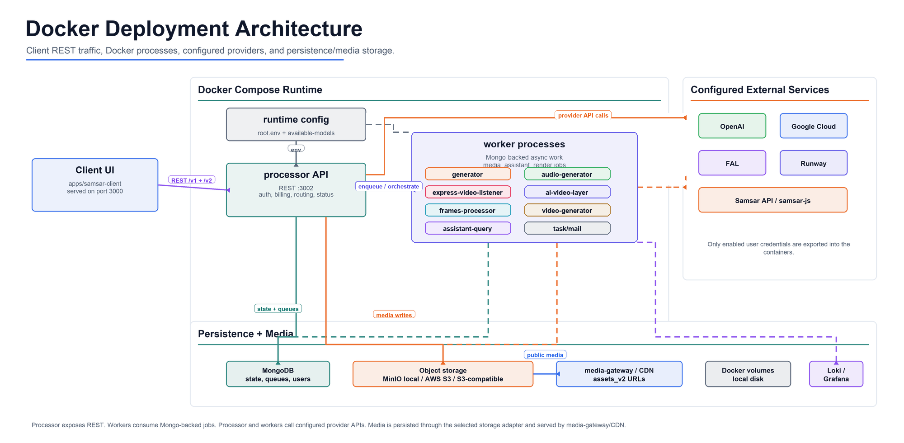

# Architecture

Samsar is organized as a deployable Docker mono-repo. The top-level `samsar` package is the wrapper that syncs source projects into `apps/*` and `services/*`, renders runtime configuration, and starts the Compose stack.

## Runtime Shape



The default Docker deployment keeps the Studio client, processor API, workers, local infrastructure, and optional logging inside the Compose runtime. The client UI calls the processor over REST; the processor and workers consume the rendered runtime config, persist state through MongoDB, write media through the configured object storage adapter, and call only the external providers enabled by the user.

## Compose Profiles

| Profile | Services | Role |
| --- | --- | --- |
| `core` | `client`, `processor` | Browser app and API. |
| `workers` | `generator`, `audio-generator`, `frames-processor`, `video-generator`, `ai-video-layer-generator`, `express-video-listener`, `assistant-query-processor`, `task-processor` | Async media and assistant work. |
| `local-mongo` | `mongo` | Local MongoDB for users, sessions, requests, credits, embeddings, and status records. |
| `minio` | `minio` | Local S3-compatible media bucket. |
| `local-media` | `media-gateway` | Nginx gateway for `/assets` and `/assets_v2`. |
| `logger` | `loki`, `promtail`, `grafana` | Local container log collection and dashboarding. |
| `reverse-proxy` | `reverse-proxy` | Optional public or intranet nginx entrypoint for Studio and the processor API on ports `80` and `443`. |

## Request Flow

1. Studio or an API client calls the processor API on `http://localhost:3002`.
2. The processor validates auth, credits, request shape, and model availability.
3. The processor writes session/request state to MongoDB and stores media in MinIO or the configured external S3-compatible store.
4. Workers pick up queued work through MongoDB-backed state and provider-specific task records.
5. Media outputs are written to Docker volumes and served through `media-gateway` at `http://localhost:8080`, or through the optional reverse proxy when a public domain/public IP is configured.
6. Clients poll status endpoints or receive webhook callbacks when provided by the request.

## Runtime Config

The primary runtime file is `runtime/config/samsar.config.json`. It is copied from `samsar.config.example.json` for local setup and edited manually or through the setup wizard.

`npm run config:render` generates:

| File | Purpose |
| --- | --- |
| `runtime/secrets/root.env` | Env file consumed by Docker services. Contains provider keys, DB/storage settings, public URLs, mail settings, and generated setup values. |
| `runtime/config/available-models.json` | Provider/model/action availability derived from enabled providers. Used by the API to filter public model responses. |

The `runtime/` directory is gitignored because it contains local credentials and generated deployment state.

## Storage and Media

Local Docker defaults to:

| Setting | Default |
| --- | --- |
| Database | `mongodb://mongo:27017/SamsarOne` |
| Object storage | MinIO at `http://minio:9000` |
| Bucket | `samsar-resources` |
| Public media base | `http://localhost:8080/` |
| Secure asset prefix | `assets_v2` |

Completed local render URLs normally look like:

```text
http://localhost:8080/assets_v2/video/output/<session-id>/<file>.mp4
```

External S3-compatible storage can be selected in the setup wizard or configured directly in `runtime/config/samsar.config.json`. When external media publishing is enabled, provider-visible URLs come from `storage.staticCdnUrl`.

The Docker reverse proxy can also provide provider-visible media URLs when it is configured with a public domain or public IP. Public/private IP installs use one machine IP: Studio is served at `http://<ip>` and the processor/media base is `http://<ip>/api`. A private IP reverse proxy is useful for intranet access, but external AI providers cannot fetch private addresses; provider calls keep using the media tunnel in that mode.

## Provider Calls

Provider credentials are loaded from `root.env`. In Docker, inference uses the model's native credential first, then OpenRouter, then the configured Samsar deployed fallback. Qwen is the exception in hosted deployments: `production`, `external-production`, `staging`, and other non-Docker runtimes always route `QWEN3.7` through `OPENROUTER_API_KEY`, regardless of saved provider provenance or an available Alibaba credential. Native Alibaba Qwen is allowed only when `CURRENT_ENV=docker`; `SAMSAR_QWEN_OPENROUTER_ONLY=true` can force the hosted rule in Docker.

The processor, generator, audio generator, AI video layer generator, express video listener, and assistant query processor use the same inference-adapter policy. Text-only Qwen requests map to `qwen/qwen3.7-max`, while requests containing image or video input map to `qwen/qwen3.7-plus`.

## Observability

The logger profile starts Loki, Promtail, and Grafana. Grafana is available on `http://localhost:4000` by default and is configured for anonymous local access in the Compose file.

Useful log command:

```bash
docker compose -f deploy/compose/docker-compose.yml logs -f processor express-video-listener video-generator
```

## Deployment Modes

| Mode | When to use | Notes |
| --- | --- | --- |
| Docker Compose | Default local install and demos | Uses local Mongo, MinIO, media gateway, and local logs unless configured otherwise. |
| Bare-metal local | Service-level development | Source Node services run on the host; Mongo/MinIO/media gateway can still run in Docker. |
| Kubernetes | Cluster deployment planning | Helm chart scaffold lives under `deploy/helm/samsar`; production templates, probes, ingress, PVCs, ConfigMaps, and Secrets still need to be added before real use. |
